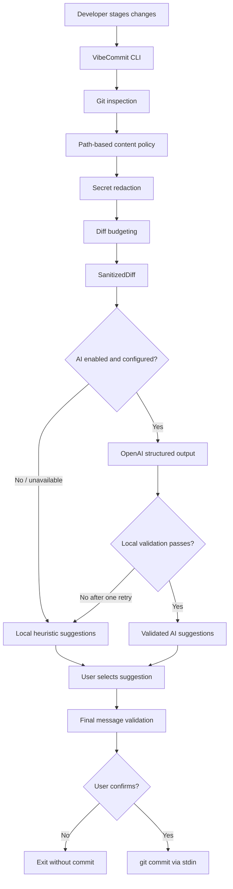

# VibeCommit

Privacy-aware AI-powered Git CLI for Conventional Commit suggestions.

[](https://github.com/YJAM20/vibecommit/actions/workflows/ci.yml)


---

## Demo

```text
vibecommit v0.1.0
Inspecting staged changes in repository...
Staged changes: 3 files (2 added, 1 modified, +42 -6)
  + src/auth.ts (modified, +18 -6)
  + docs/api.md (added, +24 -0)
  + .env (added, withheld by policy)

Privacy summary:
  - 1 sensitive value redacted
  - 1 file content withheld by path policy
  - 0 binary files withheld
Diff budget: 1,280 chars utilized (within 8,000 char budget)

Requesting commit suggestions from OpenAI (sanitized diff)...
Suggestions generated using OpenAI.

Suggested commit messages:
  1. feat(auth): implement token verification logic
  2. feat(auth): add authentication middleware and api docs
  3. refactor(auth): simplify user credential validation

Choose a suggestion (1-3): 1

Selected commit message:
  feat(auth): implement token verification logic

Create commit? (y/N): y
Commit created successfully:
  [master 7f4a2b1] feat(auth): implement token verification logic
```

For a repeatable 30–45 second recording workflow to capture terminal GIFs or screenshots, see the [Demo Recording Guide](docs/demo-script.md).

---

## Why VibeCommit?

Modern development teams often struggle with commit message consistency:

- **Diff fatigue**: Summarizing multi-file staged changes requires tedious context switching.
- **Inconsistent history**: Ad-hoc commit titles make changelog generation and bisecting difficult.
- **Privacy risks**: Blindly piping raw diffs to external LLM providers risks exposing private keys, environment files, and credentials.
- **Network dependency**: Developers frequently work offline or in environments without access to cloud AI APIs.

**VibeCommit solves this** by enforcing a strict local privacy boundary before calling OpenAI, validating suggestions against the Conventional Commits specification, and providing an instant, deterministic local fallback engine that works 100% offline.

---

## Features

- **Multi-Layer Privacy Boundary**: High-risk files (`.env`, private keys), lockfiles, generated assets, and binaries are withheld or summarized before diff processing.
- **Pattern-Based Secret Redaction**: Sensitive assignment patterns (`API_KEY`, `PASSWORD`, `JWT_SECRET`, tokens, Bearer headers) are masked prior to diff budgeting.
- **Diff Budgeting & Truncation**: Staged diff text is bounded to 8,000 characters to prevent excessive token usage and unexpected payload size.
- **Type-Branded Sanitization Boundary**: The OpenAI provider accepts only a frozen, branded `SanitizedDiff` type—raw Git diffs can never reach the provider interface.
- **Structured OpenAI Suggestions**: Requests strict JSON Schema responses conforming to Conventional Commits (`feat`, `fix`, `docs`, `refactor`, `test`, `chore`, `security`).
- **Resilient Retry & Safe Fallback**: Automatically retries invalid model outputs once; if the provider is unconfigured, times out, or fails, VibeCommit falls back immediately to local heuristics.
- **Zero-Network Mode (`--no-ai`)**: Skips all AI configuration and network initialization, generating deterministic Conventional Commit suggestions locally.
- **Dry-Run Preview (`--dry-run`)**: Displays suggestions and previews the formatted message without creating a Git commit or requiring an interactive TTY.
- **Human-in-the-Loop Gate**: Never commits automatically. Requires interactive user selection and explicit confirmation (`y/N`).
- **Safe Git Commit Execution**: Commits via standard input (`git commit -F -`) to prevent command injection or shell argument length limits.

---

## How It Works



---

## Privacy Model

VibeCommit treats all repository content as potentially sensitive. The sanitization pipeline executes locally in a strict sequence:

1. **Path Policy Classification**:
   - **Withheld**: Credentials, environment files (`.env`, `.env.*`), private keys (`*.pem`, `*.key`, `id_rsa`), and binary files are excluded from the diff text completely.
   - **Summarized**: High-noise or generated files (`package-lock.json`, `pnpm-lock.yaml`, `dist/*`, `*.min.js`) are represented as one-line metadata summaries (e.g. `[Diff withheld by policy: package-lock.json (+120 -15)]`).
   - **Included**: General source code and documentation files are forwarded to secret redaction.
2. **Secret Redaction**:
   - Matches known credential signatures (OpenAI tokens `sk-...`, GitHub tokens `ghp_...`, AWS access keys `AKIA...`, Bearer tokens).
   - Matches sensitive assignment patterns across snake_case, camelCase, and uppercase prefixes (`DB_PASSWORD`, `JWT_SECRET`, `CLIENT_SECRET`, `accessToken`).
   - Preserves benign identifiers (`primary_key`, `sort_key`, `tokenizer`, `max_tokens = 1000`), TypeScript type annotations (`password: string`), and empty values.
3. **Diff Budgeting**:
   - Redaction occurs **before** truncation so secrets near the boundary cannot escape redaction.
   - Diff content is capped at 8,000 characters with an omission marker.
4. **Branded Output**:
   - The result is encapsulated in a branded `SanitizedDiff` structure. Only this sanitized representation is supplied to the AI orchestrator.

> **Important Notice**: Pattern-based redaction is a heuristic risk-reduction control, not a cryptographic guarantee. It cannot detect every custom token format or obfuscated secret. Developers must review staged changes and should never rely solely on automated sanitization.

---

## Requirements

- **Node.js**: `v20.0.0` or higher
- **Git**: `v2.20.0` or higher

---

## Installation

Clone the repository and build locally:

```powershell
git clone https://github.com/YJAM20/vibecommit.git
cd vibecommit
npm install
npm run build
```

To make the `vibecommit` executable available system-wide:

```powershell
npm link
```

---

## Configuration

To enable AI-assisted commit suggestions, configure your OpenAI API key in your terminal session:

```powershell
# PowerShell
$env:OPENAI_API_KEY = "your-api-key-here"

# bash / zsh
export OPENAI_API_KEY="your-api-key-here"
```

Optional settings:

| Environment Variable           | Default       | Description                                                                   |
| ------------------------------ | ------------- | ----------------------------------------------------------------------------- |
| `OPENAI_API_KEY`               | _(none)_      | OpenAI API key. If omitted, VibeCommit falls back safely to local heuristics. |
| `VIBECOMMIT_OPENAI_MODEL`      | `gpt-4o-mini` | OpenAI chat completion model name.                                            |
| `VIBECOMMIT_OPENAI_TIMEOUT_MS` | `15000`       | Network request timeout in milliseconds.                                      |

_Note: VibeCommit does not load `.env` files automatically. Keys must be exported in the active shell environment._

---

## Usage

Stage your changes with Git, then launch VibeCommit:

### 1. Default Mode (AI with local fallback)

```powershell
git add src/
vibecommit
```

If `OPENAI_API_KEY` is present and valid, VibeCommit requests 3 structured suggestions from OpenAI. If unconfigured or the request fails, it prints a clear notice and presents local heuristic suggestions.

### 2. Zero-Network Mode (`--no-ai`)

```powershell
vibecommit --no-ai
```

Runs 100% offline. No API key is read, no network connection is established, and suggestions are generated deterministically based on staged file types and paths.

### 3. Dry-Run Mode (`--dry-run`)

```powershell
vibecommit --dry-run
# or combined:
vibecommit --no-ai --dry-run
```

Inspects staged changes, applies privacy sanitization, renders suggestions, and prints a preview of the formatted commit message. Never prompts for confirmation and never creates a Git commit. Works in non-interactive CI environments.

---

## Safety Guarantees and Limitations

### Verified Guarantees

- **No Unconfirmed Commits**: A Git commit is executed only when the user explicitly enters `y` or `yes` at the confirmation prompt.
- **Safe Dry-Run**: `--dry-run` contains no code path that invokes `git commit`.
- **Pre-Budget Redaction**: Secret redaction executes across the entire eligible diff before character budgeting and truncation occur.
- **Provider Isolation**: In `--no-ai` mode, the OpenAI client is never instantiated, and `OPENAI_API_KEY` is never accessed.
- **No Direct Shell Interpolation**: Commit messages are piped directly to `git commit -F -` via stdin.
- **Conventional Commits Invariant**: All suggestions (AI or heuristic) are validated against Conventional Commits before being presented and before commit execution.

### Known Limitations

- Pattern-based regex matching cannot identify high-entropy strings without recognizable prefixes or assignments.
- OpenAI mode requires an external internet connection and active OpenAI API access.
- Interactive mode requires a TTY terminal. In automated scripts or pipelines, `--dry-run` must be used.

---

## Development

Available scripts:

```powershell
npm run dev -- --dry-run   # Run directly via tsx
npm run build              # Compile TypeScript source to dist/
npm run typecheck          # Run tsc type checking without emitting files
npm run lint               # Lint source and test files with ESLint
npm run format:check       # Check formatting with Prettier
npm run format             # Reformat code with Prettier
npm test                   # Run Vitest test suite
npm run check              # Run formatting check, lint, typecheck, and tests
```

---

## Testing

The test suite covers unit and integration scenarios across 25 test files:

- **Unit tests**: CLI argument parsing, domain rules, path policy, secret redaction, diff budgeting, prompt generation, error handling.
- **Integration tests**: Temporary Git repository execution, interactive prompt mocking, sanitized privacy pipeline invariants, and AI fallback orchestration.
- **Zero Network in Tests**: Automated tests use mocked providers and synthetic Git repositories. No real API calls are made during local testing or CI.

Run all tests:

```powershell
npm test
```

---

## Architecture Decisions

- **Local Fallback**: AI suggestions are an enhancement, not a blocker. If the provider is unavailable or rate-limited, local heuristics provide instant usability.
- **Branded `SanitizedDiff`**: Prevents accidental leakage of raw Git diff strings to the network layer via compile-time brand checking.
- **Structured Outputs**: Uses OpenAI JSON Schema enforcement combined with local Zod parsing to guarantee adherence to Conventional Commit specifications.
- **Single Retry Strategy**: Automatically sends corrective feedback on malformed JSON; falls back immediately on a second failure to avoid latency spikes.
- **Human Verification**: Automation assists with drafting, but humans retain final control over what enters Git history.

---

## Roadmap

Planned future enhancements beyond the initial MVP:

- Support for additional providers (e.g. Anthropic, Google Gemini, Ollama).
- In-place commit message editing before confirmation.
- PR title and description generation from multi-commit ranges.
- Customizable Conventional Commit scopes and validation rules.
- Packaging and distribution via npm registry.

---

## Security Reporting

Please review our [Security Policy](SECURITY.md) for vulnerability disclosure guidelines. Do not report potential credentials or vulnerabilities in public issues.

---

## License

License has not yet been selected.
